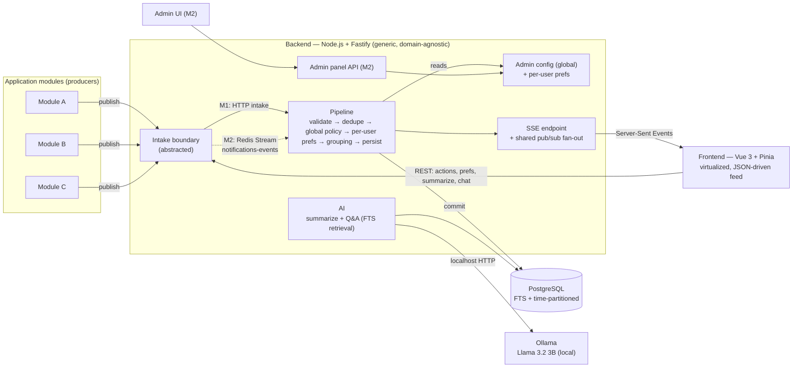
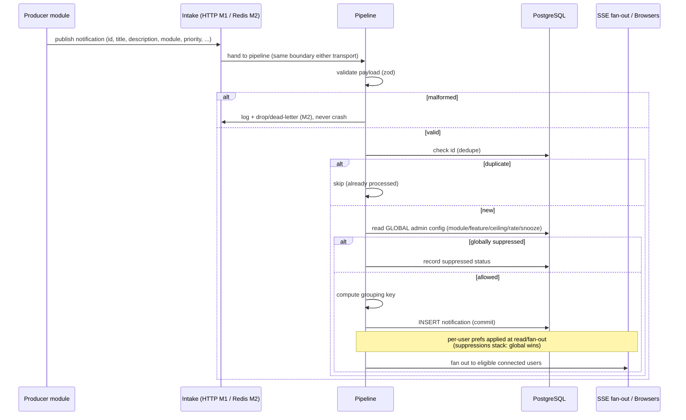
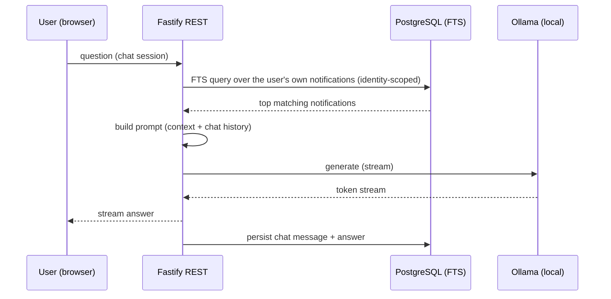
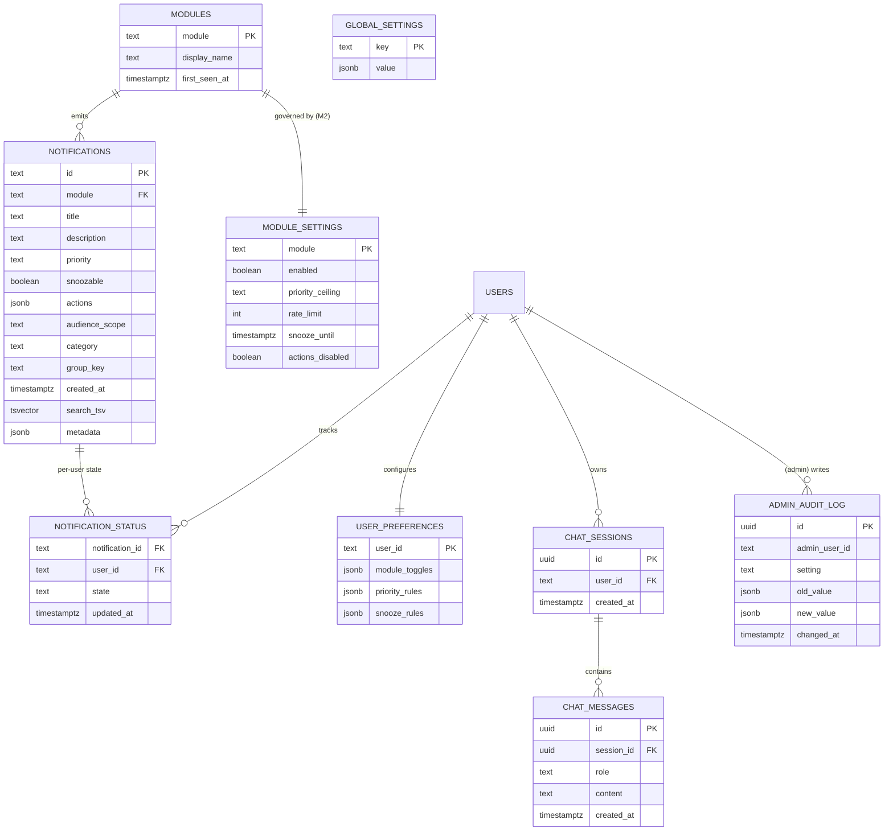
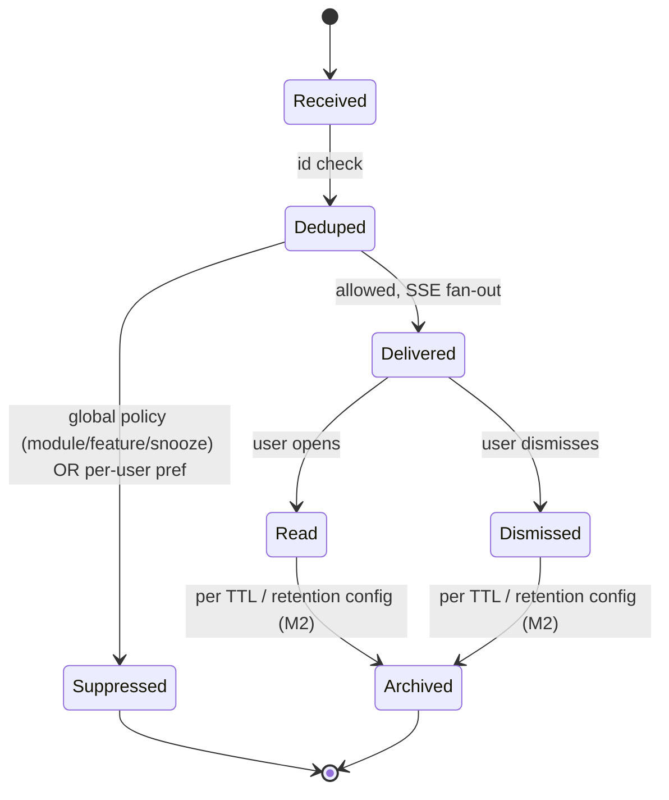
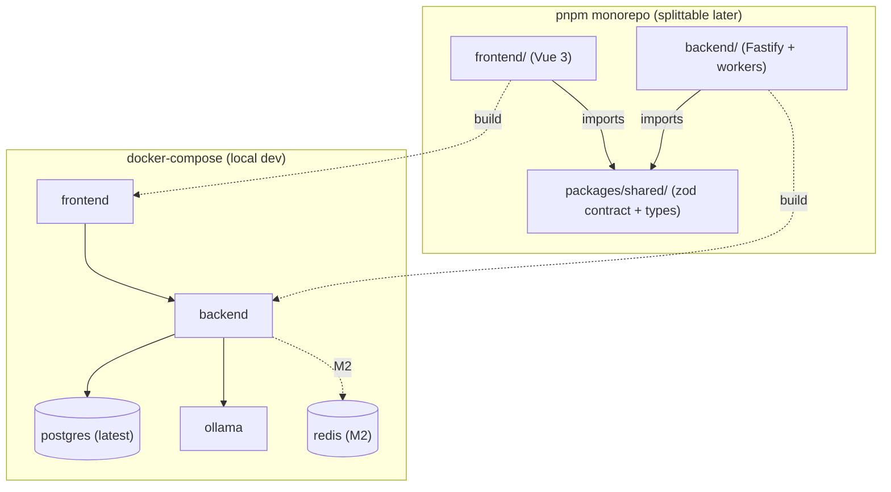

# Centralized Notification System — Architecture

Companion to `docs/srs/SRS - Centralized Notification System - v1.3.docx`. This document covers the
folder structure, the split-later strategy, the backend/frontend internal layout, the data model, the
notification message contract, the local-LLM integration, and the architecture / process diagrams.
Decisions, scope cuts, and open items are tracked in
[`srs/open-questions-and-decisions.md`](./srs/open-questions-and-decisions.md). An interactive
copy of the diagrams renders in `architecture.html` — generated from this file by
`docs/scripts/render_architecture.py` (not committed; run the script to build it). The build
timeline is in [`gantt.html`](./gantt.html).

> Unlike the SRS, this architecture doc intentionally keeps implementation detail — that is its job.

## Two principles that shape everything below

- **Generic, domain-agnostic backend.** Every notification flows through one fixed contract with an
  opaque `metadata` field the system stores and passes through but never interprets. Transport and
  delivery are abstracted, policy is data-driven (no per-module code), and a new source module or
  delivery channel needs no changes to the core.
- **Dynamic, JSON-driven frontend.** As much of the UI as practical — notification cards, filters,
  admin controls, preferences — is rendered from schemas/configuration by shared renderers, so a
  notification of a new kind renders without frontend code.

## Delivery phasing

- **Milestone 1 (focus): the frontend feed + AI over a basic backend.** A simple intake (internal /
  HTTP publish) feeds the generic pipeline → SSE → a virtualized, JSON-driven feed. Categorization,
  grouping, prioritization, filtering, snoozing, actions, AI summaries, the Q&A chatbot, and the
  per-user preferences panel. Built one feature at a time.
- **Milestone 2: administration + the event stream.** The Admin panel and its governance, full
  authorization, and the Redis Streams intake path (behind the same intake boundary — no pipeline
  rewrite).

## Locked decisions

| Area | Decision |
|---|---|
| Policy model | **Global, admin-governed base + per-user layer.** Suppressions stack — a global disable/snooze always wins; per-user settings may only further restrict. |
| Administration | **Admin panel governs behavior for all users** (M2). First cut is a proof-of-concept. |
| Backend shape | **Generic / domain-agnostic** — one contract + opaque `metadata`; abstracted transport; delivery behind a common adapter; no per-module code. |
| Frontend shape | **Dynamic / JSON-driven** — cards, filters, admin, prefs rendered from schemas/config by shared renderers. |
| Intake | **Abstracted boundary.** M1: simple internal/HTTP publish. M2: **Redis Streams** (consumer groups, XACK-after-durable, dead-letter). |
| Delivery surface | **In-app only** (intake in → SSE out), with a shared pub/sub fan-out. No email/SMS/push/chat platforms. |
| Modules | **Auto-discovered** on first publish — no pre-registered allowlist. |
| Audience/scope | Notification carries an `audience`: **`global` now**; `team`/`user` reserved. Per-team needs specific team identifiers (deferred). |
| Tenancy | **Single deployment**, not multi-tenant. |
| Performance | **First-class.** FE: list virtualization (lightweight lib, not Vuetify), keyset-paginated/infinite scroll, coalesced SSE, server-side grouping/filtering. BE: indexes incl. FTS GIN, keyset pagination, config/prefs caching, batched ingest, shared SSE fan-out, time-partitioning + retention. |
| AI retrieval | **PostgreSQL Full-Text Search** (`tsvector`/`tsquery`) + text/metadata grouping. **No pgvector.** |
| LLM | **Local, via Ollama** co-located with the backend. Default **Llama 3.2 3B Instruct**; generation only. |
| Backend framework | **Fastify** + TypeScript. |
| Database | **Latest stable PostgreSQL** (dev `docker-compose` pins 16 — bump to match). |
| Auth (NFR-4) | **Phased** — admin role + per-user identity scoping scaffolded in M1, fully enforced in M2. |
| Privacy | **Not required** — developer-studio environment, notification content is dev-generated. |
| Dedupe | On the notification **`id`** (used as the idempotency key). |

## Monorepo structure (splittable into separate repos later)

A single pnpm workspace now, for solo-build velocity. The **only** cross-boundary coupling is
`packages/shared`; `frontend/` and `backend/` never import each other directly. To split into
separate repos later: publish `shared` to a private registry (or GitHub Packages) and pin versions,
or vendor / git-submodule it — each app already has its own `package.json`, `tsconfig`, and
`Dockerfile`, so the top-level workspace glue is all that has to be removed.

```
/
├─ pnpm-workspace.yaml
├─ package.json              # root scripts + dev tooling only
├─ tsconfig.base.json        # extended by each package
├─ docker-compose.yml        # postgres (bump 16 → latest) + ollama now; redis added in M2
├─ .env.example              # add OLLAMA_URL, LLM_MODEL, rate-limit knobs (REDIS_URL in M2)
├─ frontend/                 # Vue 3 app — own package.json, tsconfig, Dockerfile
├─ backend/                  # Fastify API + (M2) Redis consumers/workers — own package.json, Dockerfile
│  └─ migrations/            # SQL migration files (never hand-edit schema)
├─ packages/shared/          # zod schemas + TS types (the notification contract) — publishable
└─ docs/                     # architecture.md, architecture.html, gantt-*, srs/
```

### Backend internal layout
Aligns with `.claude/rules/redis-streams.md` and `.claude/rules/notifications-domain.md`.

```
backend/src/
├─ server.ts                 # Fastify bootstrap
├─ config/env.ts             # zod-validated env at startup (DB, OLLAMA_URL, LLM_MODEL, rate-limit; REDIS_URL in M2)
├─ http/
│  ├─ routes/                # REST: publish (M1 intake), preferences, actions, summarize, chat
│  ├─ admin/                 # (M2) config, module governance, broadcasts, audit, observability, dead-letter, export/import
│  └─ sse/                   # SSE endpoint + shared pub/sub fan-out (one query per event, not per client)
├─ intake/
│  ├─ boundary.ts            # abstracted intake interface — the pipeline never cares HOW a notification arrived
│  ├─ http-intake.ts         # M1: simple internal/HTTP publish path
│  ├─ redis-consumer.ts      # M2: XREADGROUP loop; group "notifications-service", stream "notifications-events"
│  └─ dead-letter.ts         # M2: XPENDING / retry-count → "notifications-events:dead-letter"
├─ pipeline/
│  ├─ validate.ts            # zod validation of the envelope (malformed → safe handling, never crash)
│  ├─ dedupe.ts              # dedupe on notification id (unique constraint / seen-ids ledger)
│  ├─ policy.ts              # GLOBAL admin config: module enable/disable, feature flags, priority ceiling, rate limit, snooze
│  ├─ preferences.ts         # PER-USER layer — suppressions stack (global disable always wins)
│  ├─ grouping.ts            # text/metadata matching-key grouping of similar notifications
│  └─ persist.ts             # DB write (commit) THEN ack; fan-out to SSE
├─ channels/
│  ├─ adapter.ts             # interface: send(notification): Promise<DeliveryResult>
│  └─ in-app-sse.adapter.ts  # the only channel in M1
├─ ai/
│  ├─ llm-client.ts          # Ollama HTTP client (streaming)
│  ├─ summarize.ts           # on-demand + scheduled
│  └─ qa.ts                  # FTS retrieval → prompt → stream (Q&A chatbot)
├─ db/
│  ├─ pool.ts · scope.ts     # scope.ts sets the authenticated user for per-user tables (phased: scaffold M1, enforce M2)
│  ├─ partitions.ts          # time-partition maintenance + retention
│  └─ migrate.ts
└─ workers/scheduled-summary.ts
backend/test/                # vitest: dead-letter, idempotency, global-disable-wins, snooze, rate-limit, malformed paths
```

### Frontend internal layout
Aligns with `.claude/skills/design-system` and `.claude/skills/json-form-conventions`.

```
frontend/src/
├─ design/tokens.ts          # color, type scale, spacing, radius — no Tailwind defaults
├─ components/ui/            # Button, Input, Card, Modal, Skeleton, EmptyState, ErrorState, VirtualList
├─ renderers/                # dynamic UI: NotificationCardRenderer (config-driven card), FilterRenderer
├─ forms/                    # *.form.ts schemas rendered by the shared FormRenderer (prefs, admin config)
├─ features/
│  ├─ notifications/         # NotificationsView (virtualized, paginated feed), FilterBar, PriorityList, ThreadGroup
│  ├─ chat/                  # ChatPanel (AI Q&A)
│  ├─ settings/              # per-user preferences panel (module toggles, priority, snooze)
│  └─ admin/                 # (M2) governance, kill-switches, AI config, observability, broadcasts, audit, export/import
├─ stores/                   # Pinia: live SSE feed (shallowRef for large lists), preferences, chat, adminConfig
└─ api/                      # REST client + SSE subscription (coalesced updates)
```
Every data view ships **loading, empty, and error** states — not optional.

## Data model (PostgreSQL — latest stable)

Notifications are **global** (all users see them, subject to policy), so the notification row is not
per-user. **Per-user data** — read/dismiss/snooze status, preferences, and chat history — is scoped to
the server-side authenticated identity (authorization is phased: scaffolded in M1, enforced in M2).
`USERS` is the host application's existing identity, referenced by id (this system does not own the
user table). Delivery/read state is a **durable fact stored separately** from the notification, keyed
per user. De-duplication uses the notification **`id`**. Modules are **auto-discovered** on first
publish. The notifications table is **time-partitioned** with a retention/TTL policy. (In M2 the
dead-letter queue is a Redis stream, not a table.)

## Notification message contract (`packages/shared`)

One zod schema, validated on intake and shared front/back. The contract is the stable boundary of the
generic backend — new needs are met by extending the opaque `metadata`, not by changing the shape:

```ts
{
  id: string,                      // required — also the de-dupe / idempotency key
  module: string,                  // required — originating module (auto-discovered)
  title: string,                   // required — short heading
  description: string,             // required — body text
  priority: 'low' | 'normal' | 'high' | 'critical',
  snoozable: boolean,              // may this notification be snoozed?
  actions?: { label: string; method: string; url: string }[],  // module-owned callbacks
  audience?: { scope: 'global' | 'team' | 'user'; id?: string }, // 'global' now; team/user reserved (id = future team/user identifier)
  category?: string,               // optional; else derived from module/domain
  timestamp?: string,              // ISO; else set on intake
  metadata?: Record<string, unknown>, // opaque — stored & passed through, never interpreted by the system
}
```

## Local LLM integration (Ollama)

- Ollama runs as a container in `docker-compose` (or a host process), reachable at `OLLAMA_URL`
  (default `http://localhost:11434`). Model in `LLM_MODEL` (default `llama3.2:3b-instruct`).
- The backend `ai/llm-client.ts` streams completions; `summarize.ts` and `qa.ts` are the only
  callers. **Retrieval is Postgres FTS** — the model does generation only, so no embedding pipeline.
- Because the model is local, **notification content never leaves the deployment** — and there is no
  per-call API cost or external-service dependency.

---

## Diagrams

### 1. System architecture



### 2. Ingestion pipeline (sequence)



### 3. AI Q&A chatbot (sequence)



### 4. Data model (ER)



> `id`, `module`, `title`, `description`, `priority`, `snoozable`, `actions`, `audience`, `metadata`
> come straight from the wire contract; `category`, `group_key`, `created_at`, and `search_tsv` are
> system-managed. `GLOBAL_SETTINGS` (feature flags, AI config, quiet hours) and `MODULE_SETTINGS`
> (per-module governance) are the "central settings" the Admin panel edits (M2) and can export/import.

### 5. Notification lifecycle (state)



### 6. Monorepo & local deployment



> **Timeline:** the build phasing (M1 frontend + AI, then M2 admin + Redis) is rendered in
> [`gantt.html`](./gantt.html), generated from [`gantt-tasks.json`](./gantt-tasks.json). Regenerate
> with the `gantt-chart` skill after editing the JSON.
