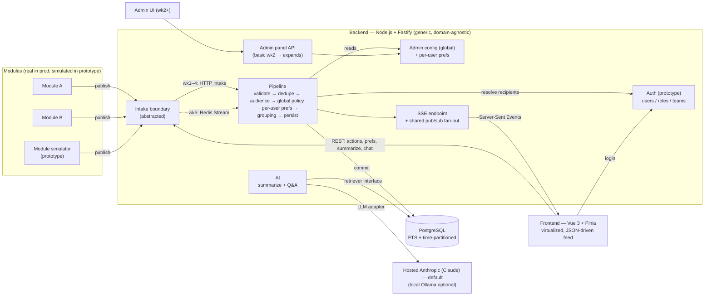
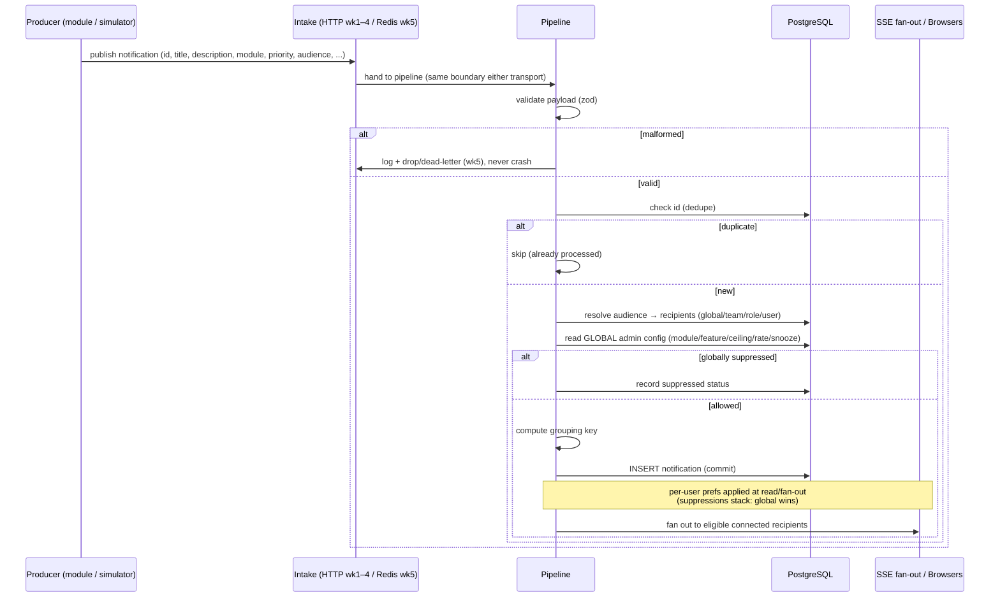
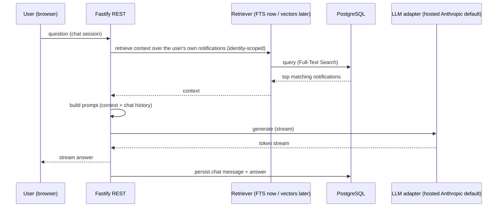
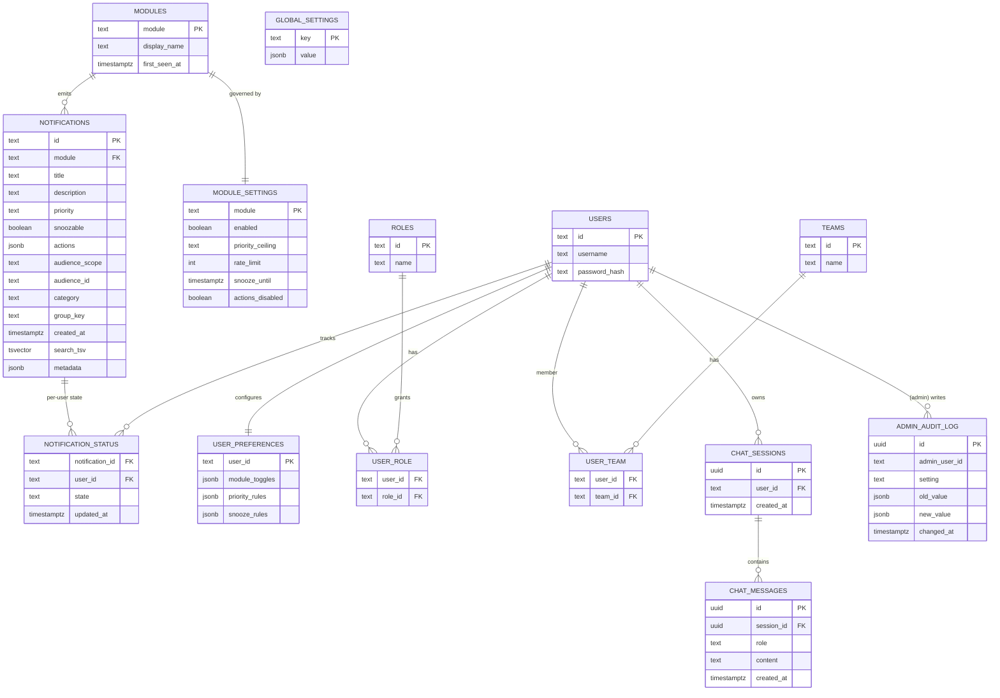
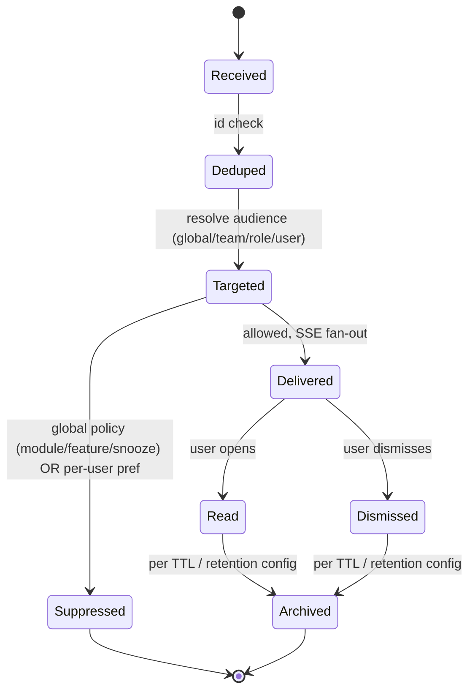
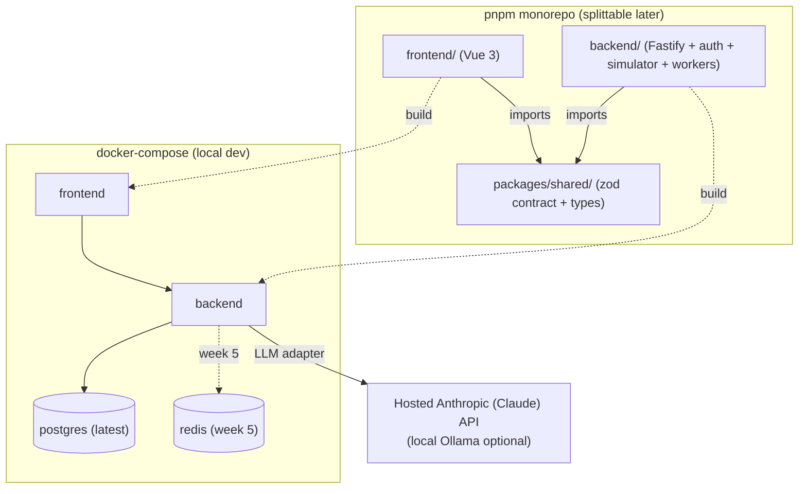

# Centralized Notification System — Architecture

Companion to `docs/srs/SRS - Centralized Notification System - v1.3.docx`. This document covers the
folder structure, the split-later strategy, the backend/frontend internal layout, the data model, the
notification message contract, the AI/LLM integration, and the architecture / process diagrams.
Decisions, scope cuts, and open items are tracked in
[`srs/open-questions-and-decisions.md`](./srs/open-questions-and-decisions.md). An interactive
copy of the diagrams renders in `architecture.html` — generated from this file by
`docs/scripts/render_architecture.py` (not committed; run the script to build it). The build
timeline is in [`gantt.html`](./gantt.html).

> Unlike the SRS, this architecture doc intentionally keeps implementation detail — that is its job.

## Two principles that shape everything below

- **Generic, domain-agnostic backend.** Every notification flows through one fixed contract with an
  opaque `metadata` field the system stores and passes through but never interprets. Transport and
  delivery are abstracted, policy is data-driven (no per-module code), and a new source module or
  delivery channel needs no changes to the core.
- **Dynamic, JSON-driven frontend.** As much of the UI as practical — notification cards, filters,
  admin controls, preferences — is rendered from schemas/configuration by shared renderers, so a
  notification of a new kind renders without frontend code.

## Delivery roadmap (5 weekly milestones, functional at each)

1. **Skeleton + live feed** — prototype auth (login/session, seeded users/roles/teams); a module
   simulator; generic intake → dedupe → persist → SSE; a live, JSON-driven feed with incremental loading.
2. **Basic admin + organized feed** — module auto-discovery; a basic Admin panel (enable/disable
   modules, feature kill-switches) enforcing global policy; categorization, prioritization, filtering.
3. **AI features** — LLM adapter (hosted Anthropic/Claude default); on-demand + scheduled summaries;
   Q&A chatbot (FTS via a retriever interface); admin AI configuration.
4. **Audiences + prefs + interaction** — global/team/role/user targeting (seeded teams + roles);
   per-user preferences beneath the global policy (suppressions stack); grouping, snooze, actions, navigate.
5. **Hardening + admin expansion** — audit log, resource/health observability, broadcasts, config
   export/import, global controls, TTL; **Redis Streams intake + dead-letter** behind the same boundary;
   performance pass + tests; the production-auth seam. Stretch: semantic (vector) retrieval.

## Locked decisions

| Area | Decision |
|---|---|
| Policy model | **Global, admin-governed base + per-user layer.** Suppressions stack — a global disable/snooze always wins; per-user settings may only further restrict. |
| Administration | **Admin panel governs behavior for all users** — basic in week 2, expands through week 5. |
| Backend shape | **Generic / domain-agnostic** — one contract + opaque `metadata`; abstracted transport; delivery behind a common adapter; no per-module code. |
| Frontend shape | **Dynamic / JSON-driven** — cards, filters, admin, prefs rendered from schemas/config by shared renderers. |
| Intake | **Abstracted boundary.** Weeks 1–4: simple direct/HTTP publish (driven by the simulators). Week 5: **Redis Streams** (consumer groups, XACK-after-durable, dead-letter). |
| Audience/scope | Notification carries an `audience` = `{ scope, id? }` with scope **`global` \| `team` \| `role` \| `user`** — all four built. Teams and roles are modeled on users. |
| Delivery surface | **In-app only** (intake in → SSE out), with a shared pub/sub fan-out. No email/SMS/push/chat platforms. |
| Modules | **Auto-discovered** on first publish — no pre-registered allowlist. Simulated in the prototype. |
| AI / LLM | **Pluggable LLM adapter; hosted Anthropic (Claude) model by default**; local (Ollama) swappable. Generation only. |
| AI retrieval | **PostgreSQL Full-Text Search now, behind a retriever interface**; **vector embeddings (pgvector) later** (stretch). |
| Auth | **Prototype: own simple auth** (username/password + session; users, roles, team membership; seeded). **Production: host-application identity** (a kept seam). |
| Performance | **First-class.** FE: list virtualization (lightweight lib, not Vuetify), keyset-paginated/infinite scroll, coalesced SSE, server-side grouping/filtering. BE: indexes incl. FTS GIN, keyset pagination, config/prefs caching, batched ingest, shared SSE fan-out, time-partitioning + retention. |
| Tenancy | **Single deployment**, not multi-tenant. |
| Backend framework | **Fastify** + TypeScript. |
| Database | **Latest stable PostgreSQL** (dev `docker-compose` pins 16 — bump to match). |
| Privacy | **Not required** — developer-studio environment, notification content is dev-generated. |
| Dedupe | On the notification **`id`** (used as the idempotency key). |

## Monorepo structure (splittable into separate repos later)

A single pnpm workspace now, for solo-build velocity. The **only** cross-boundary coupling is
`packages/shared`; `frontend/` and `backend/` never import each other directly. To split into
separate repos later: publish `shared` to a private registry (or GitHub Packages) and pin versions,
or vendor / git-submodule it — each app already has its own `package.json`, `tsconfig`, and
`Dockerfile`, so the top-level workspace glue is all that has to be removed.

```
/
├─ pnpm-workspace.yaml
├─ package.json              # root scripts + dev tooling only
├─ tsconfig.base.json        # extended by each package
├─ docker-compose.yml        # postgres now; redis added in week 5
├─ .env.example              # DB_URL, SESSION_SECRET, ANTHROPIC_API_KEY, LLM_PROVIDER/MODEL, rate-limit knobs (REDIS_URL in wk5)
├─ frontend/                 # Vue 3 app — own package.json, tsconfig, Dockerfile
├─ backend/                  # Fastify API + (wk5) Redis consumers/workers — own package.json, Dockerfile
│  └─ migrations/            # SQL migration files (never hand-edit schema)
├─ packages/shared/          # zod schemas + TS types (the notification contract) — publishable
└─ docs/                     # architecture.md, architecture.html, gantt-*, srs/
```

### Backend internal layout
Aligns with `.claude/rules/redis-streams.md` and `.claude/rules/notifications-domain.md`.

```
backend/src/
├─ server.ts                 # Fastify bootstrap
├─ config/env.ts             # zod-validated env at startup (DB, SESSION_SECRET, ANTHROPIC_API_KEY, LLM_PROVIDER/MODEL, rate-limit; REDIS_URL wk5)
├─ auth/                     # PROTOTYPE simple auth: login/session, users/roles/teams, seed — swapped for host-app identity in prod
├─ sim/                      # module simulator(s): emit notifications across modules/priorities/audiences
├─ http/
│  ├─ routes/                # REST: publish (direct intake), preferences, actions, summarize, chat
│  ├─ admin/                 # config, module governance, broadcasts, audit, observability, dead-letter, export/import (grows wk2→wk5)
│  └─ sse/                   # SSE endpoint + shared pub/sub fan-out (one query per event, not per client)
├─ intake/
│  ├─ boundary.ts            # abstracted intake interface — the pipeline never cares HOW a notification arrived
│  ├─ http-intake.ts         # weeks 1–4: simple internal/HTTP publish path
│  ├─ redis-consumer.ts      # week 5: XREADGROUP loop; group "notifications-service", stream "notifications-events"
│  └─ dead-letter.ts         # week 5: XPENDING / retry-count → "notifications-events:dead-letter"
├─ pipeline/
│  ├─ validate.ts            # zod validation of the envelope (malformed → safe handling, never crash)
│  ├─ dedupe.ts              # dedupe on notification id (unique constraint / seen-ids ledger)
│  ├─ audience.ts            # resolve audience {scope,id} → recipients (global/team/role/user)
│  ├─ policy.ts              # GLOBAL admin config: module enable/disable, feature flags, priority ceiling, rate limit, snooze
│  ├─ preferences.ts         # PER-USER layer — suppressions stack (global disable always wins)
│  ├─ grouping.ts            # text/metadata matching-key grouping of similar notifications
│  └─ persist.ts             # DB write (commit) THEN ack; fan-out to SSE
├─ channels/
│  ├─ adapter.ts             # interface: send(notification): Promise<DeliveryResult>
│  └─ in-app-sse.adapter.ts  # the only channel for now
├─ ai/
│  ├─ llm/adapter.ts         # provider-agnostic LLM interface (streaming)
│  ├─ llm/anthropic.ts       # default hosted provider (Claude); llm/ollama.ts = optional local
│  ├─ retrieval/retriever.ts # retriever interface; retrieval/fts.ts now, pgvector later (stretch)
│  ├─ summarize.ts           # on-demand + scheduled
│  └─ qa.ts                  # retrieve → prompt → stream (Q&A chatbot)
├─ db/
│  ├─ pool.ts · scope.ts     # scope.ts sets the authenticated user for per-user tables
│  ├─ partitions.ts          # time-partition maintenance + retention
│  └─ migrate.ts
└─ workers/scheduled-summary.ts
backend/test/                # vitest: dedupe/idempotency, global-disable-wins, audience resolution, snooze, rate-limit, malformed, dead-letter
```

### Frontend internal layout
Aligns with `.claude/skills/design-system` and `.claude/skills/json-form-conventions`.

```
frontend/src/
├─ design/tokens.ts          # color, type scale, spacing, radius — no Tailwind defaults
├─ components/ui/            # Button, Input, Card, Modal, Skeleton, EmptyState, ErrorState, VirtualList
├─ renderers/                # dynamic UI: NotificationCardRenderer (config-driven card), FilterRenderer
├─ forms/                    # *.form.ts schemas rendered by the shared FormRenderer (prefs, admin config)
├─ features/
│  ├─ auth/                  # login screen (prototype auth)
│  ├─ notifications/         # NotificationsView (virtualized, paginated feed), FilterBar, PriorityList, ThreadGroup
│  ├─ chat/                  # ChatPanel (AI Q&A)
│  ├─ settings/              # per-user preferences panel (module toggles, priority, snooze)
│  └─ admin/                 # basic in wk2 → governance, kill-switches, AI config, observability, broadcasts, audit, export/import
├─ stores/                   # Pinia: session, live SSE feed (shallowRef for large lists), preferences, chat, adminConfig
└─ api/                      # REST client + SSE subscription (coalesced updates)
```
Every data view ships **loading, empty, and error** states — not optional.

## Data model (PostgreSQL — latest stable)

Notifications carry an **audience** (`global` / `team` / `role` / `user`); recipients are resolved from
the audience against the identity data (all users; a team's members; a role's holders; or one user).
**Per-user data** — read/dismiss/snooze status, preferences, chat history — is scoped to the
authenticated user. In the **prototype** the system owns `USERS`, `ROLES`, `TEAMS`, and their
memberships (seeded via the built-in auth); in **production** identity comes from the host application
and these local tables fall away. Delivery/read state is a **durable fact stored separately** from the
notification, keyed per user. De-duplication uses the notification **`id`**. Modules are
**auto-discovered** on first publish. The notifications table is **time-partitioned** with a
retention/TTL policy. (In week 5 the dead-letter queue is a Redis stream, not a table.)

## Notification message contract (`packages/shared`)

One zod schema, validated on intake and shared front/back. The contract is the stable boundary of the
generic backend — new needs are met by extending the opaque `metadata`, not by changing the shape:

```ts
{
  id: string,                      // required — also the de-dupe / idempotency key
  module: string,                  // required — originating module (auto-discovered)
  title: string,                   // required — short heading
  description: string,             // required — body text
  priority: 'low' | 'normal' | 'high' | 'critical',
  snoozable: boolean,              // may this notification be snoozed?
  actions?: { label: string; method: string; url: string }[],  // module-owned callbacks
  audience: { scope: 'global' | 'team' | 'role' | 'user'; id?: string }, // id identifies the team/role/user for non-global scopes
  category?: string,               // optional; else derived from module/domain
  timestamp?: string,              // ISO; else set on intake
  metadata?: Record<string, unknown>, // opaque — stored & passed through, never interpreted by the system
}
```

## AI / LLM integration

- The LLM sits behind a provider-agnostic **adapter** (`ai/llm/adapter.ts`). The **default is a hosted
  Anthropic (Claude) model** — the one the team has access to — configured via `ANTHROPIC_API_KEY` +
  `LLM_MODEL` (API key is env config, validated at startup, never in code). A **local model via Ollama**
  remains a swappable provider (`LLM_PROVIDER=ollama`).
- `summarize.ts` and `qa.ts` are the only callers; both go through the adapter for generation and
  through the **retriever interface** for context. Retrieval is **PostgreSQL Full-Text Search** now
  (`retrieval/fts.ts`); **vector embeddings (pgvector)** are a later, localized upgrade behind the same
  interface.
- Privacy is not a constraint here (developer-generated content), which is why a hosted model is the
  default; the adapter keeps the local option open if that ever changes.

---

## Diagrams

### 1. System architecture



### 2. Ingestion pipeline (sequence)



### 3. AI Q&A chatbot (sequence)



### 4. Data model (ER)



> `USERS` / `ROLES` / `TEAMS` (+ the join tables) are owned by the prototype auth and replaced by
> host-application identity in production. `audience_scope` + `audience_id` come from the wire contract;
> `GLOBAL_SETTINGS` (feature flags, AI config, quiet hours) and `MODULE_SETTINGS` (per-module governance)
> are the "central settings" the Admin panel edits and can export/import. The admin role (in `ROLES`)
> grants access to the Admin panel.

### 5. Notification lifecycle (state)



### 6. Monorepo & local deployment



> **Timeline:** the five weekly milestones are rendered in [`gantt.html`](./gantt.html), generated from
> [`gantt-tasks.json`](./gantt-tasks.json). Regenerate with the `gantt-chart` skill after editing the JSON.
```
